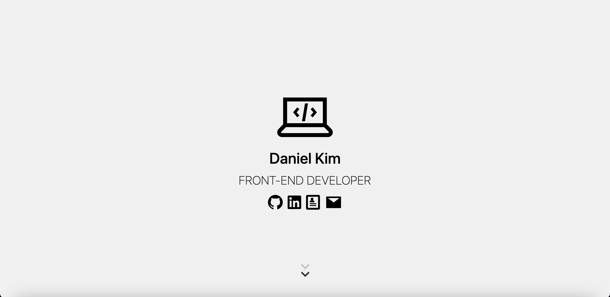

# Personal Website with plain HTML, CSS and vanilla JavaScript

 

This is a portfolio website built with plain HTML, CSS and vanilla JavaScript.

<a href="https://iconify.design">Iconify</a> is used for SVG.

This website is fully responsible to any screen sizes.

<h3>:star: Design Inspirations</h3>

<a href="https://dorota1997.github.io/react-frontend-dev-portfolio">Davina Griss</a>
 
<a href="https://pedroklepa.com">Pedro Klepa</a>
 
<a href="https://sultanbadri.github.io">Sultan Badri</a>
